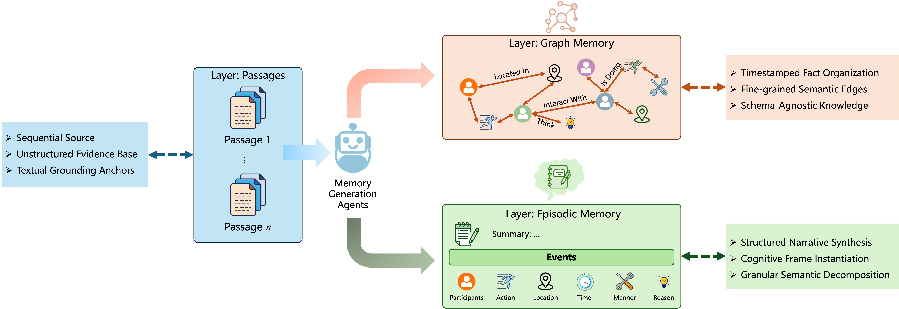
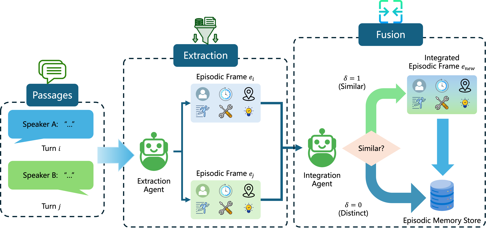
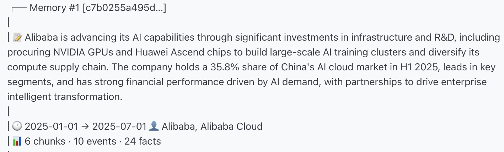
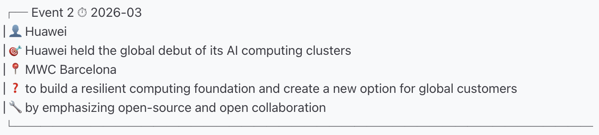
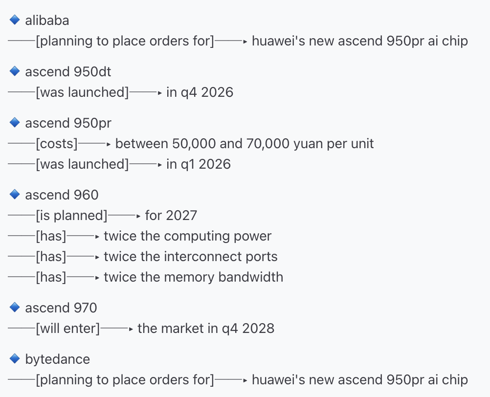

# 🧠 SEEM

**Structured Episodic Event Memory** for LLM agents. Built on cognitive frame theory, SEEM organizes memory hierarchically.

<p align="center">
  
  <br>
  <em>Overview of the SEEM hierarchical memory architecture.</em>
</p>

<p align="center">
  
  <br>
  <em>Overview of the associative consolidation and fusion.</em>
</p>

<p align="center">
  <a href="https://arxiv.org/abs/2601.06411"></a>
  <a href="https://github.com"></a>
  <a href="#"></a>
</p>

---

## Memory Representation Showcase

### Memory Summary

Each memory entry is anchored by a concise **summary** that captures the core narrative. Attached to the summary is **provenance metadata** — speaker, timestamp range, involved entities, and links to the original source utterances.

<p align="center">
  
  <br>
  <em>A memory summary with its associated provenance metadata.</em>
</p>

### Episodic Event

Within each memory, individual **events** are extracted with six dedicated slots: *participants*, *action*, *time*, *location*, *reason*, and *method*. The action slot captures only the core occurrence, while temporal, spatial, and causal details occupy their own slots.

<p align="center">
  
  <br>
  <em>An extracted event with six dedicated slots.</em>
</p>

### Semantic Facts

Events are further decomposed into **relational facts** — triples that connect entities through predicates. These facts form a knowledge graph linking entities across memories, enabling graph-aware retrieval over relational structures.

<p align="center">
  
  <br>
  <em>Relational facts extracted from events, forming a cross-memory knowledge graph.</em>
</p>

---

## Paper Highlights

Conventional LLM memory systems predominantly rely on static retrieval. SEEM introduces a structured alternative:

- **Beyond Static RAG** — instead of passive document retrieval, SEEM builds cognitive-inspired memory structures
- **Hierarchical Architecture** — relational facts live in a graph layer while narratives progress through dynamic episodic memory
- **Episodic Event Frames (EEFs)** — conversation streams become structured frames with provenance tracking
- **Reverse Provenance Expansion (RPE)** — backfill mechanism reconstructs fragmented evidence into coherent narrative context
- **Associative Fusion** — cross-layer linking connects related information dynamically

---

## Key Advantages

| Advantage | Description |
|-----------|-------------|
| **Cognitive-Inspired Design** | Memory structure grounded in frame theory, reflecting human memory organization with hierarchical episodic and graph-based representations. |
| **Dual-Layer Architecture** | Relational facts reside in a graph layer while narratives progress through dynamic episodic memory, each with dedicated retrieval mechanisms. |
| **Provenance-Aware** | Every memory carries source pointers, enabling tracking of where information originated. |
| **Automatic Consolidation** | Related events merge into coherent summaries through an LLM-judged integration pipeline without manual intervention. |
| **Graph-Aware Retrieval** | Personalized PageRank traverses the knowledge graph along entity relationships to surface contextually relevant memories. |
| **Adjustable Recall Depth** | Three recall modes (Lite, Pro, Max) control context granularity, from concise fact-based summaries to full source text with backfill. |

---

## Quick Start

### 1. Install

```bash
pip install -r requirements.txt
```

### 2. Configure

Set environment variables for API access:

```bash
export LLM_API_KEY="sk-xxx"
export LLM_BASE_URL="https://api.deepseek.com"
export LLM_MODEL="deepseek-chat"

export MM_ENCODER_API_KEY="sk-xxx"
export MM_ENCODER_BASE_URL="https://api.siliconflow.cn/v1"
export MM_ENCODER_MODEL="Qwen/Qwen3-Embedding-8B"
```

Alternatively, edit `config.py` to change default settings such as retrieval strategy, embedding model, and integration parameters. Environment variables take priority over `config.py` values.

| Parameter | Default | Description |
|-----------|---------|-------------|
| `retrieve_strategy` | `ppr` | Retrieval strategy: `dpr` / `hybrid_rrf` / `ppr` |
| `top_k_chunks` | 3 | Number of results to retrieve |
| `top_k_facts` | 5 | Number of facts to retrieve |
| `enable_integration` | `True` | Automatically merge related memories |
| `integration_window` | 3 | How often to check for merges |
| `enable_fact_graph` | `True` | Build knowledge graph |

### 3. Use

```bash
# Store a message
python scripts/cli_memory.py store --speaker "Alice" --text "Lena asked about dogs"

# Recall relevant memories
python scripts/cli_memory.py recall --query "What did Lena ask?"

# View the knowledge graph
python scripts/cli_memory.py facts

# Browse all memories
python scripts/cli_memory.py display

# Check stats
python scripts/cli_memory.py stats
```

---

## Python API

```python
from SEEM import SEEMSkill, SEEMConfig

skill = SEEMSkill(SEEMConfig())

# Store
mid = skill.store({"text": "Lena asked about dogs", "speaker": "Alice"})

# Recall
result = skill.recall({"text": "What did Lena ask?"}, top_k=3)
```

---

## CLI Reference

```bash
# Store
cli_memory.py store --text "message"
cli_memory.py store --speaker "Alice" --text "message"
cli_memory.py store --dialogue-id "D1:1" --speaker "Alice" --text "message"
cli_memory.py store --text "check this out" --image-path photo.jpg --image-caption "a dog"

# Recall
cli_memory.py recall --query "your question"
cli_memory.py recall --query "your question" --strategy ppr --mode pro --top-k 5

# Browse
cli_memory.py facts                  # knowledge graph
cli_memory.py facts --entity "Lena"  # filter by entity
cli_memory.py display                # detailed view
cli_memory.py view                   # compact view

# Manage
cli_memory.py stats
cli_memory.py clear --yes
```
---

## OpenClaw Skill

SEEM is packaged as an [OpenClaw](https://docs.openclaw.ai) agent skill. To install:

1. Copy the `SEEM/` directory into your workspace's `skills/` folder.
2. Set the required environment variables (`LLM_API_KEY`, `MM_ENCODER_API_KEY`) in your OpenClaw config or shell profile.
3. The agent will automatically discover the skill and use it for structured memory operations.

No additional configuration is needed. The agent reads `SKILL.md` to understand when and how to invoke store, recall, and display commands.

---

## Citation

```bibtex
@article{lu2026seem,
  title   = {Structured Episodic Event Memory},
  author  = {Zhengxuan Lu and Dongfang Li and Yukun Shi and Beilun Wang and Longyue Wang and Baotian Hu},
  journal = {arXiv preprint arXiv:2601.06411},
  year    = {2026}
}
```
